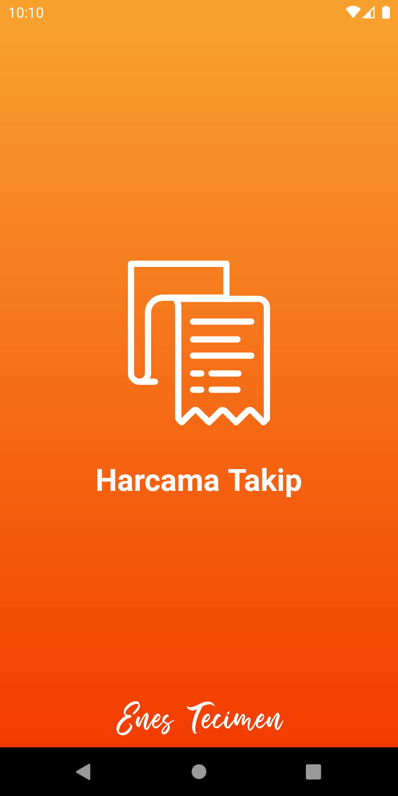
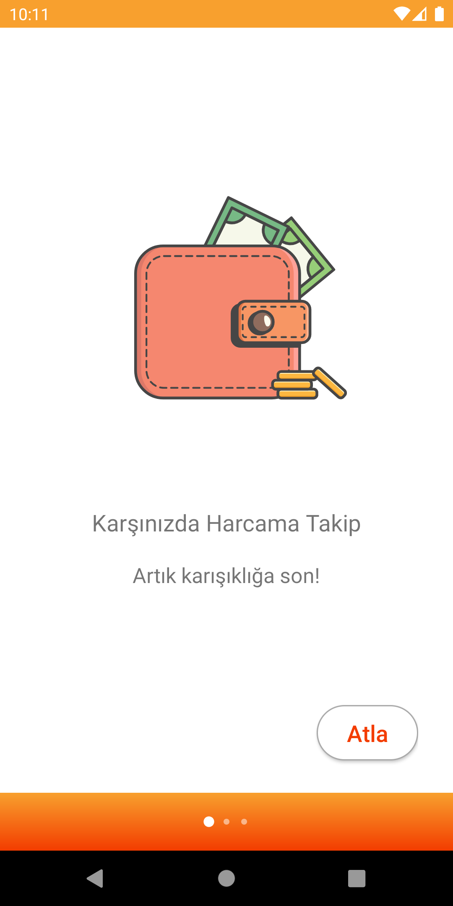
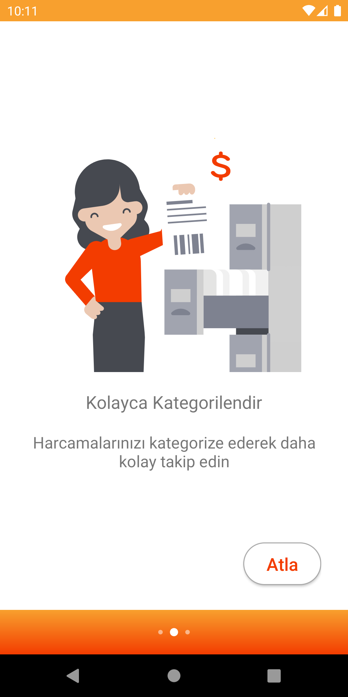
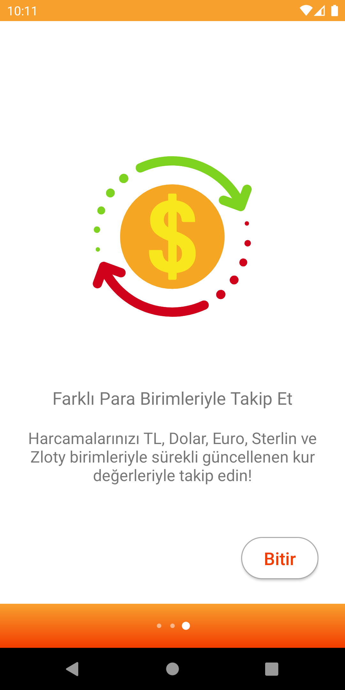
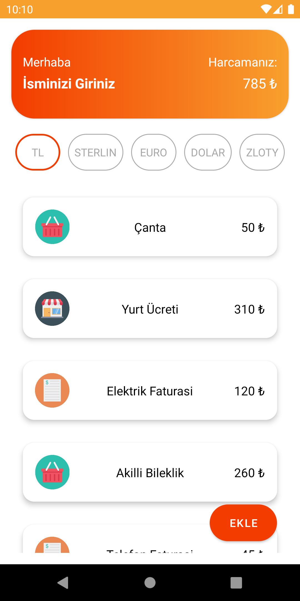
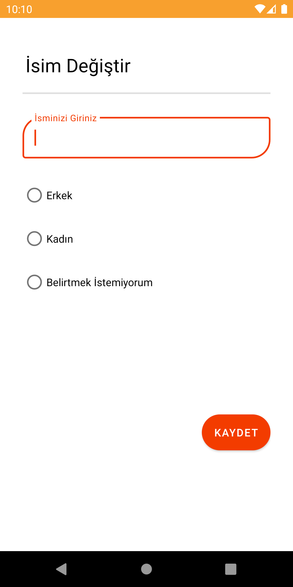
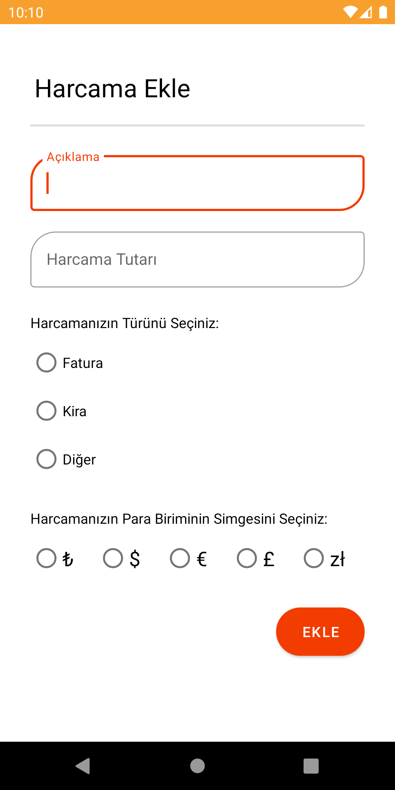
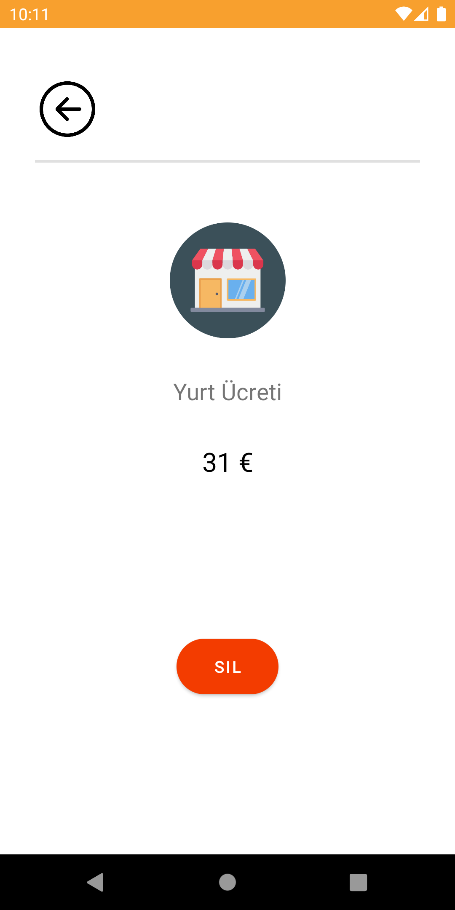

# Harcama Takip
## GDG - Android Bootcamp Turkey Bitirme Projesi

Google Developer Groups Turkey tarafından 22 Şubat 2021 - 23 Nisan 2021 tarihleri arasında düzenlenen Android Bootcamp eğitiminin bitirme projesidir.

**Harcama Takip**; kullanıcının harcamalarını takip edip, farklı para birimlerini içinde kullanacağı, kendi ismini ve toplam harcama miktarını uygulama içinde görüntüleyebilemesini sağlayan bir uygulamadır.

### Splash ve Onboarding Ekranı
Uygulama açıldığında 3 saniyelik bir splash screen'in ardından onboarding screen ile karşılaşılmaktadır.

  
 

### Ana Sayfa Ekranı
Uygulamada TL (Türk Lirası), GBP (İngiliz Sterlini), EUR (Euro), USD (Amerikan Doları) ve PLN (Polonya Zlotysi) olmak üzere 5 para birimi bulunmaktadır. Her para birimine tıklandığında harcamaların ilgili para birimine ait tutarı ve toplam harcaması güncel kur verileri ile gösterilmektedir.
Offline'da çalışabilmektedir.

### İsim Değiştirme Ekranı
Anasayfa üzerinden "İsminizi Giriniz"e tıklayarak İsim Değiştir ekranına ulaşılmaktadır. Yapılan tercihe göre kullanıcıya ana sayfada farklı şekillerde hitap edilmektedir.

 

### Harcama Ekleme Ekranı
Ekle butonu yoluyla yeni harcama eklemesi yapılmaktadır. Buradaki her alanın doldurulması zorunludur.

 

### Harcama Detay Ekranı
Ekleme sonrasında ana sayfada Recyclerview içerisindeki harcamaların detayları ayrı ayrı görüntülenebilmekte ve silinebilmektedir.

